# User Guide — Playing the Gameshow

This guide explains how to participate in a gameshow as a **player** or **host**.

---

## What is this?

A browser-based team quiz game for **live events**. Two teams compete across multiple rounds. The host controls the app, while both teams answer questions together in the same room.

---

## 1. Starting the Game

Open the app in a browser. You will see the **Home Screen**.

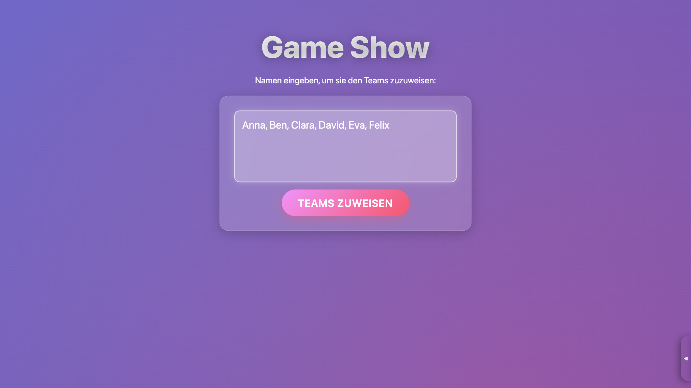
> *Add screenshot: `docs/screenshots/home-screen.png` — the home screen with player name fields and a "Weiter" button*

Enter the names of all players into the text field, separated by commas:

```
Anna, Ben, Clara, David
```

Click **Weiter**. The app randomly assigns players to **Team 1** and **Team 2**.

> **Tip:** If the team randomization screen does not appear, the host has disabled it. The game starts directly.

---

## 2. Rules Screen

Before the first game, the global rules of the gameshow are shown.

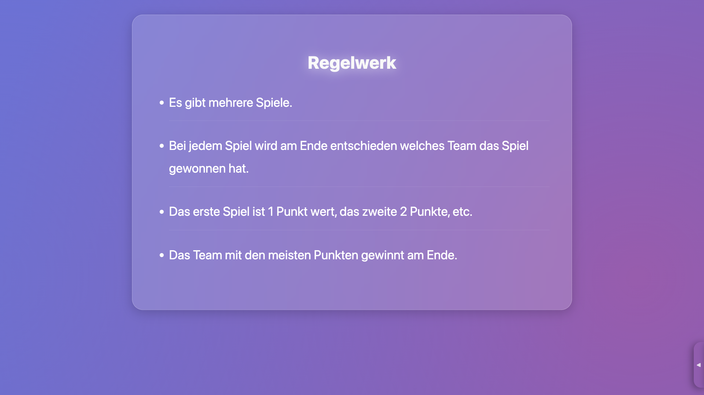
> *Add screenshot: `docs/screenshots/rules-screen.png` — the global rules screen*

Read the rules, then click **Weiter** or press the **right arrow key** to continue.

---

## 3. During a Game

### The Header

At the top of the screen you always see:

- Both **team names** and their current **point totals**
- Which game you are on (e.g. *Spiel 2 von 5*)


> *Add screenshot: `docs/screenshots/header.png` — the persistent header showing team scores and game counter*

### Navigation

| Action | Key / Click |
|--------|-------------|
| Next step / reveal answer | `→` Arrow, `Space`, `Enter`, or click anywhere |
| Go back (where supported) | `←` Arrow or `Backspace` |

---

## 4. Game Types

### Simple Quiz

A question is shown. Both teams discuss and give their answer. The host then reveals the correct answer.

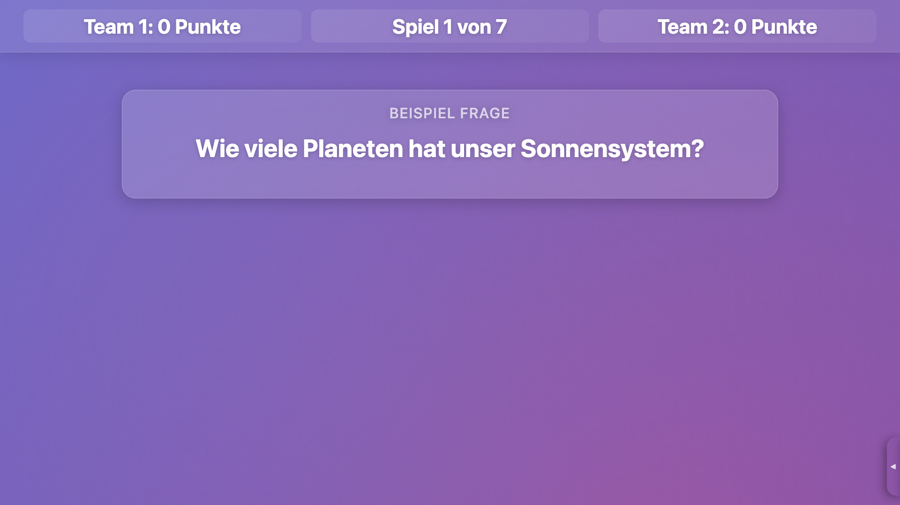
> *Add screenshot: `docs/screenshots/simple-quiz-question.png` — a question displayed on screen*

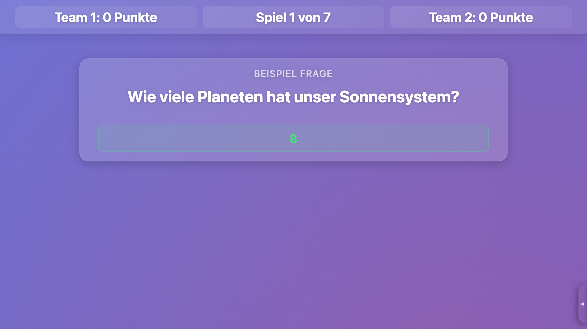
> *Add screenshot: `docs/screenshots/simple-quiz-answer.png` — the answer revealed*

The host awards points to the winning team.

---

### Guessing Game (Schätzspiel)

A numerical question is asked (e.g. *"How many kilometers is it from Berlin to Tokyo?"*).

Both teams write down a number — the team whose guess is **closest** to the correct answer wins.

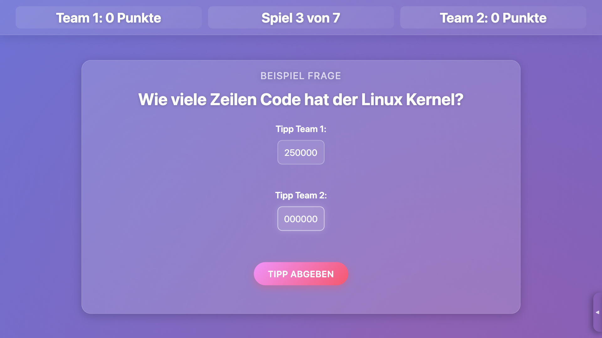
> *Add screenshot: `docs/screenshots/guessing-game.png` — the guessing game screen with both team inputs*

---

### Q1 (Vier Aussagen)

Four statements about a topic are shown. **Three are true, one is false.**

Teams discuss and pick the statement they think is wrong.

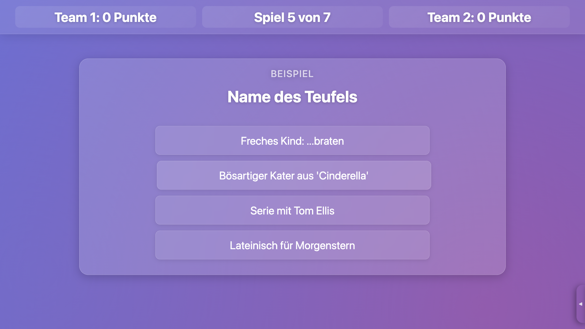
> *Add screenshot: `docs/screenshots/q1.png` — the Q1 statements screen*

The host reveals which statement was false. (This game was previously named "four-statements".)

---

### Four Statements (Hinweise raten)

Up to four clue-statements are revealed one at a time. Teams guess the target concept. After the last clue, the host reveals the answer (text and/or image).

---

### Fact or Fake (Fakt oder Fake)

A single statement is shown. Teams decide: **Fakt** (true) or **Fake** (false)?

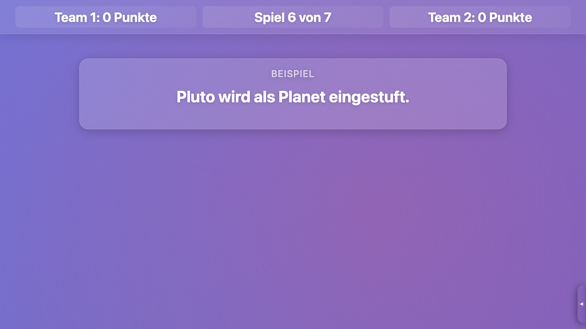
> *Add screenshot: `docs/screenshots/fact-or-fake.png` — the fact-or-fake screen*

The host reveals the answer and an explanation.

---

### Audio Guess (Audio-Raten)

A music clip plays automatically. Teams try to identify the **song or artist**.

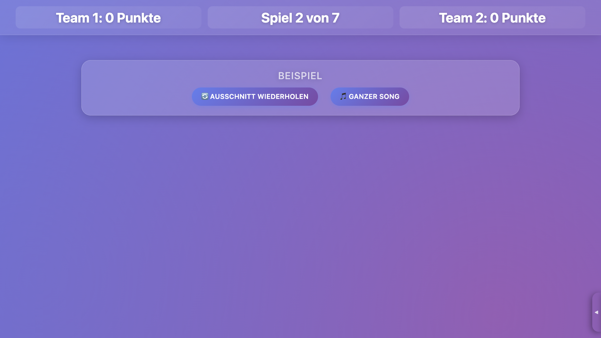
> *Add screenshot: `docs/screenshots/audio-guess.png` — the audio guess screen with play controls*

> **Note:** Background music fades out automatically during this game type.

---

### Quizjagd

Teams take turns. The active team picks a **difficulty level**:

| Difficulty | Points |
|------------|--------|
| Easy | 3 |
| Medium | 5 |
| Hard | 7 |

A question is shown. If the answer is correct, the team earns the points. If wrong, the points are **deducted** (minimum 0).

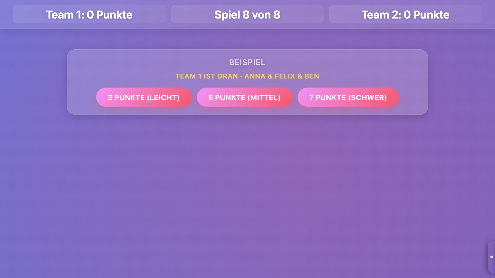
> *Add screenshot: `docs/screenshots/quizjagd.png` — the quizjagd difficulty selection screen*

Points are awarded **immediately** — there is no separate points screen for this game type.

---

### Final Quiz

A fast-paced buzzer round. The host reads a question and clicks the team that buzzed in first. Correct = +1 point. Wrong = the other team gets a chance.

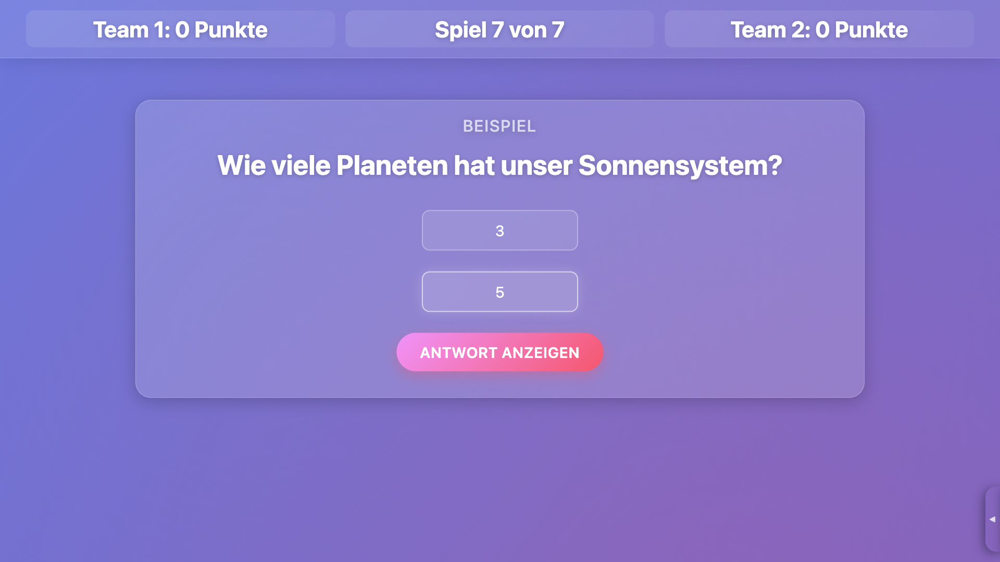
> *Add screenshot: `docs/screenshots/final-quiz.png` — the final quiz buzzer screen*

---

## 5. Awarding Points

After most game types, the host sees a points screen:

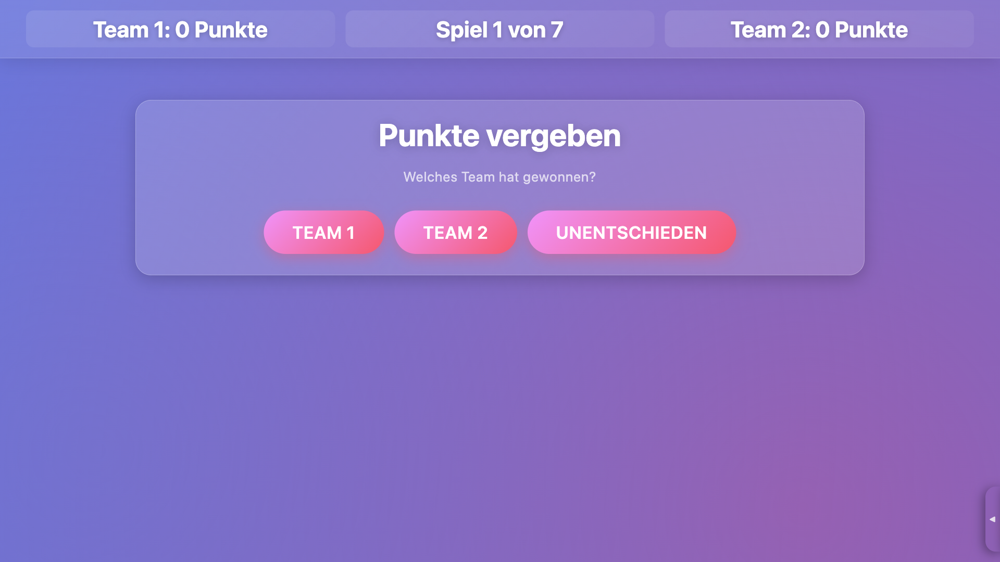
> *Add screenshot: `docs/screenshots/award-points.png` — the award points screen with Team 1, Draw, Team 2 buttons*

The host clicks the winning team (or **Unentschieden** for a draw). Points are added automatically and the next game begins.

---

## 6. Background Music

A music panel is available on the right edge of the screen. Click the **tab** to open it.

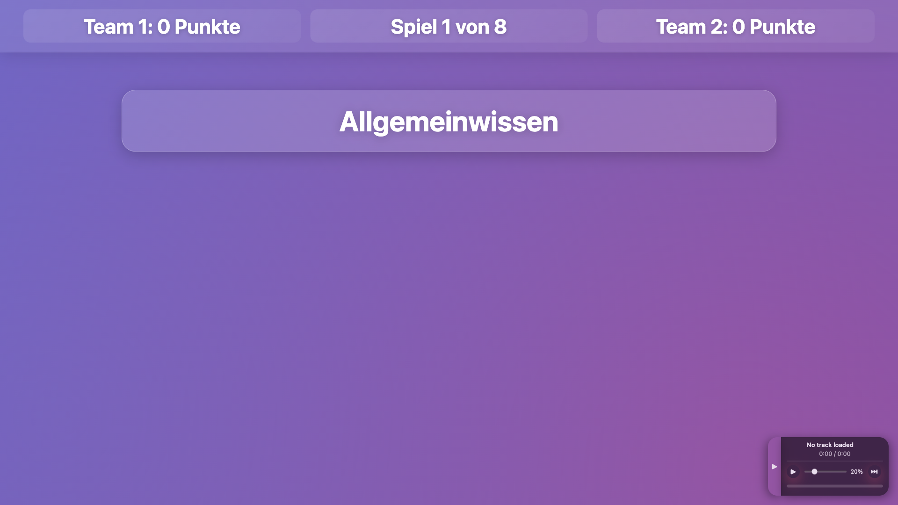
> *Add screenshot: `docs/screenshots/music-panel.png` — the slide-out music panel*

From here you can:
- Play / pause music
- Skip to the next track
- Adjust volume

Music crossfades smoothly between tracks (3-second fade).

---

## 7. End of the Gameshow

After all games are complete, the **Summary Screen** appears.

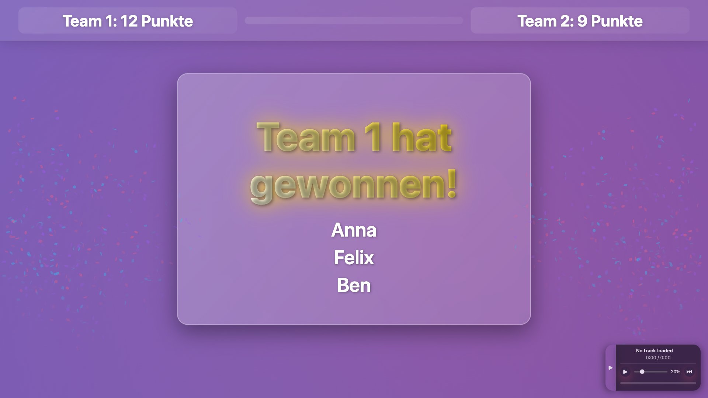
> *Add screenshot: `docs/screenshots/summary-screen.png` — the winner announcement with confetti*

The winner is announced with a confetti animation. If both teams have the same score, a draw is declared.

---

## Keyboard Shortcuts Overview

| Key | Action |
|-----|--------|
| `→` / `Space` / `Enter` | Advance / reveal answer |
| `←` / `Backspace` | Go back (within a game) |

---

*For admin and setup instructions, see the [Admin Guide](./admin-guide.md).*
